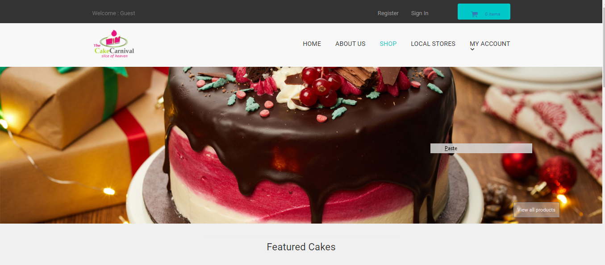
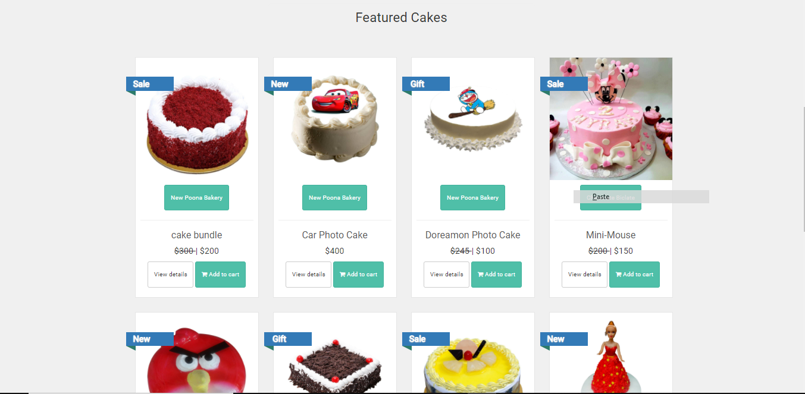
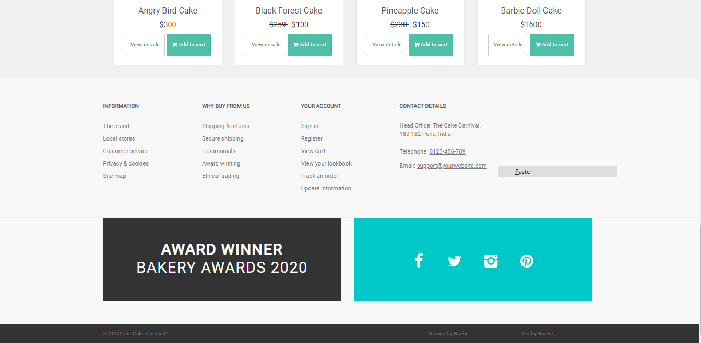
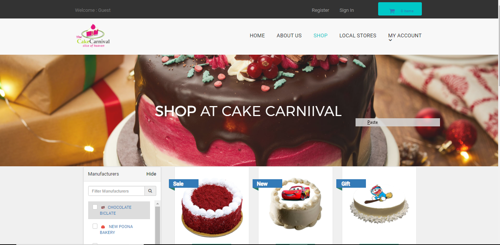
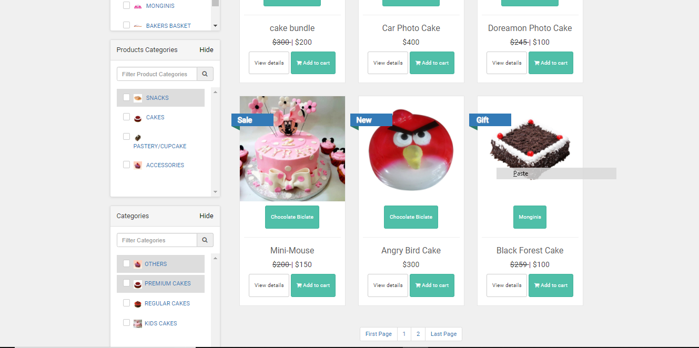
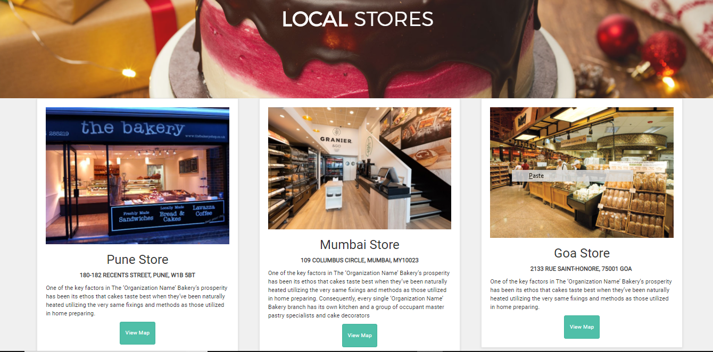
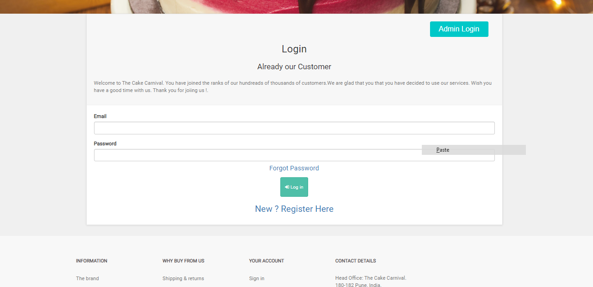
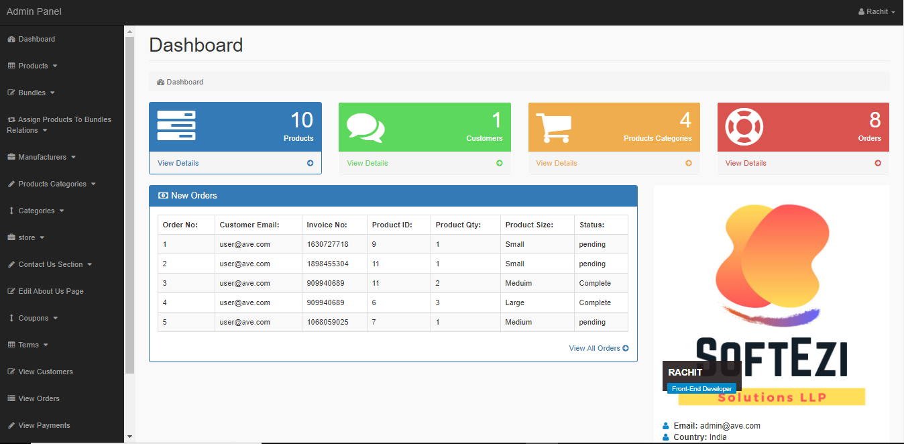
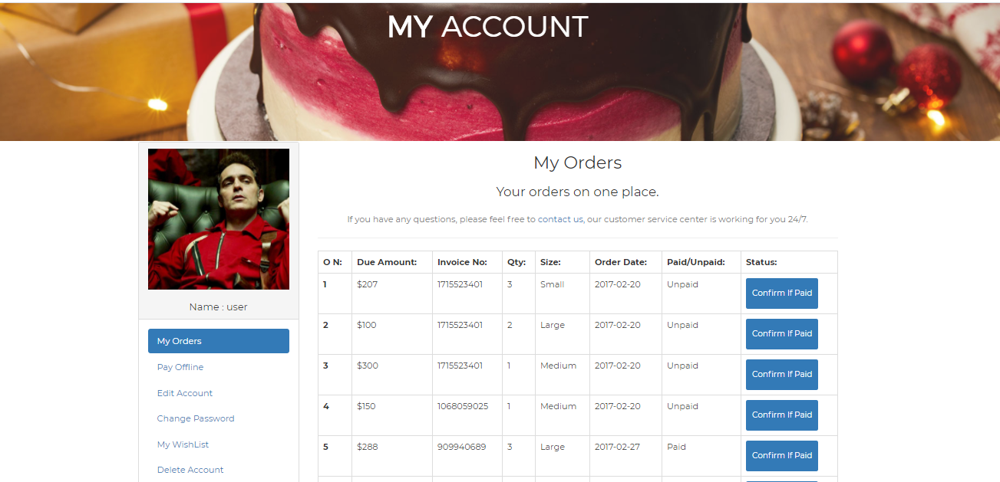

# Ecommerce-Website

Steps to run the project:- 
1. Clone the project to the respective Xamp or Wamp folder 
2. Open Phpmyadmin then create a database name  ecom_store 
3. Now import the ecom_store.sql file to the database. 
4. Now change the db.php file which you can find under the includes folder according to your id and password for mysql connection 
5. Now run the index.php file 
6. Enjoy !!

# Description :point_left:
It's an Ecommerce Website for a Bakery where user and buy any type of cakes and snacks. Customer have to first register himself to buy the cake. An admin section is implemented
whre the admin can add the products, store location , and also print bills and view orders that are placed.

# Technologies

### Backend

### Frontend

### Database
  

# Output-Screenshots 
## Home Page
    
##
    
##
    
## Shopping Page
    
##
    
## Local Store
    
## Login Page
    
## Admin Login
    
## Admin Page
    
## Customer Page
    
